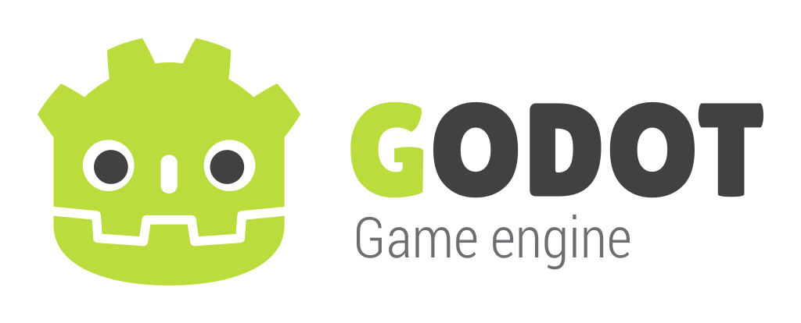

# green-godot

  

This is a modification of Godot Engine (v3.6), a Multi-platform 2D and 3D game engine.
The purpose of this repository is to share what I use with others.

Why v3.6? To support older hardware.

Official [README](https://github.com/godotengine/godot/blob/3.6.1-stable/README.md)

## Download

See [Releases](https://github.com/Wolf-Pack-Clan/green-godot/releases)

## Todo

- FX engine
